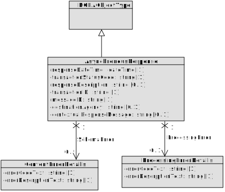

# Asynchronous Response Messaging

The Subscriber to any message will send a response message through the service bus to convey the results of message processing. The response message goes through the same process as the request message, but since it is one to one communication, the queue messaging pattern will be used. The sending agency needs to provide an endpoint to receive the response message. It is agency’s responsibility to correlate the request message and response message by using message meta data or the message body.

## Preceding Exchange: 

Any

## Triggering Event:

Receipt and processing of any JTMP message received by a Subscriber

## Real-World Effects: 

Robust response messaging gives the Publisher of a message the assurance that the critical data being shared has been received and properly processed. It also gives each Subscriber the ability to communicate back to the Publisher any time an error is encountered in processing and storing a published message. 

## Data Requirements:

### Key data elements include:
- Original TransactionID from the published message
- New, unique MessageID that identifies the response as a separate message
- Error code
- Text field to include error message encountered, or text provided by an end user (who may be rejecting a message for a business reason). 

## Artifacts:
**XML Schemas:** 

**Mapping Spreadsheet:**

**Sample XML:** 

**Class Diagram:** 

