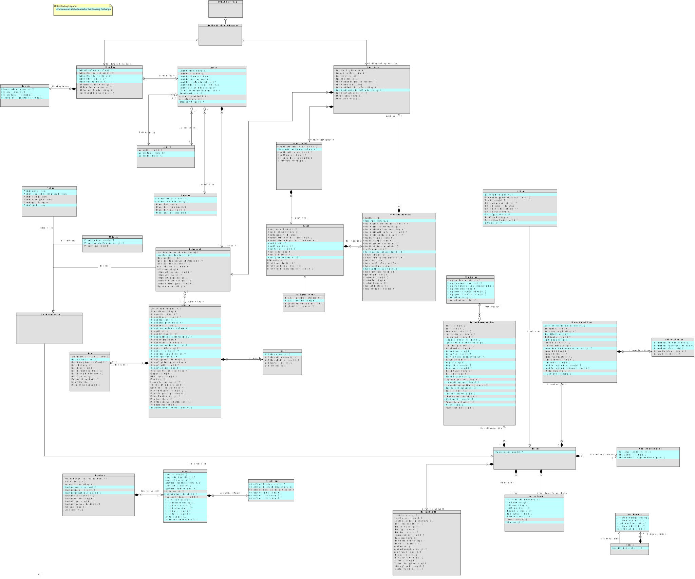

# Bookings and Releases

The Jail Management System will publish a Booking and Release message each time a client is either booked  into the jail or released for any reason (ROR, Bond, No Probable Cause, Disposition, etc.).

Booking and Release are distinct MessageTypes when making an API call to publish a JMS transaction. However both will use the same XML schema to format the payload of the message. 

## Preceding Exchange: 

Arrest Report (from Police Department)​

## Triggering Events:

1. Supervisor Approval in JMS of a new Booking
2. Supervisor Approval in JMS of a JMS Release

## Real-World Effects: 

The purpose of this data exchange is to notify Subscriber systems of a new jail event. On a new jail booking, subscribers will have the data needed to create a new termporary case for preparing for the next step in the criminal justice process (e.g., a first appearance, indigent defense determination or charge review). 

Subscribers may create new pending case events or update previously-created events. Many Subscriber systems will opt to stage incoming events in a queue or review screen pending human action to import into the case management system. 

## Data Requirements:

[XML Schemas](schemas/booking-iepd/api/xml_schema/)

### Key Booking data elements include:
- Booking Numbe, generated by the JMS, to uniquely identify the arrest event
- Sheriff's Control Number (SCN) the state-generated number that uniquenly identifies the Arrest Cycle in the Louisiana's Autoumated Fingerprint Identification System (AFIS) and its Computerized Criminal History (CCH)
- Person ID number - a person ID or master name index number generated by the JMS as its internal unique ID
- State ID (SID) number, which is the state AFIS identifying number tied to a unique set of fingerprints. This number should be associated with an individual over the course of a lifetime, potentially multiple booking events in Orleans Parish and other jurisdictions.
- Charge data that conveys Charge Statute and Description as defined in the City of New Orleans' uniform charge table (UCT). See https://github.com/CityOfNewOrleans/JTMP-Data-Exchange-Specs/blob/main/ChargeCodeUpdateExchange.md for details.

### Key Release data elements include:
- Sheriff's Control Number (SCN)
- Person ID
- State ID (SID)
- Court Case ID. Return the court case number value that was provided in a Case Initiation message from the Court CMS
- Release Date
- Release Time
- Release Reason
- Bond Paied

## Artifacts:

[Mapping Spreadsheet](schemas/booking-iepd/artifacts/booking_mapping_spreadsheet.xlsx)

**Class Diagram:**

[Sample XML File](schemas/booking-iepd/examples/Annotated_NOLA_Booking_msg.xml)

