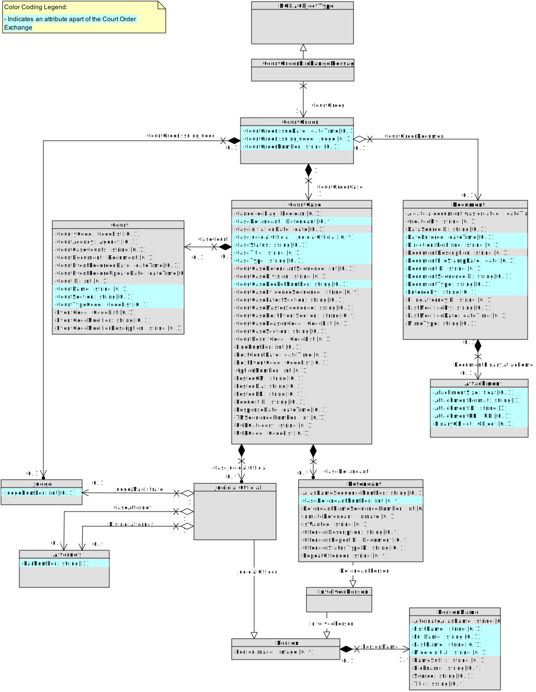

# Court Order Exchange

A Courts' Case Management (CMS)) will publish a Court Order message each time a court clerk dockets an Order or adds a document to a case docket. 

The publisher may be the CMS of any court jurisdiction - Criminal, Juvenile, or Municipal & Traffic. 

## Preceding Exchange: 

Charge Screening Action (new Criminal charges filed - from District Attorney)
Case Initiation (new criminal case established, Court publishes Case Number and Filed Charges)​

## Triggering Event:

1. Judge approves a court order
2. Court clerk adds the Order to a court case docket
3. (TBD) A Court Clerk modifies an existing Order.  

## Real-World Effects: 

The purpose of this data exchange is to keep partner justice systems in sync with the court case docket in the court clerk's CMS, which is the official system of record of court proceedings.  Publishing a Court Order as a transaction, as soon as it is docketed in the CMS, gives the parties --the Prosecutor and Public Defender-- the assurance that their case files are up to date. 

One tangible benefit is attorneys can more efficiently prepare for upcoming case proceedings, as they will have all approved Orders "at their fingertips" in the applicatoin they use on a day-to-day basis, without a separate query to a court's system or an online representation of the docket. 

The data exchange will include the XML data necessary to identify the case to which the filing is to attach, as well as information to identify the type of document. This will likely be based on a Document Type codelist that will be provided by the Clerk of Court. Subscriber systems will be expected to either use the court's published code list, or to map incoming code-value pairs to the appropriate document types in the application. 

The Court Order data exchange will include a Status indicator, indicating to the Subscribing system whether the Order is New or Updated. 

Subscriber systems will match the incoming Court Order with the Court Case ID (which had previously been received in a Case Initition message). Subscriber systems will have internal processing and requirements on how a case file in the application interacts with a document to be stored in a document management system or module. 

## Data Requirements:
### Key data elements include:
- Status indicator -- New or Updated Order
- Court Case ID
- Document Code (enumerated code list)
- Order Docketed Date (court clerk's staff will determine if this is a machine-generated date-time stamp, or the date of the judicial officer's approval)
- Order Docketed Time
- Judicial Official (the Judge or Magistrate who approved/signed the Order)

## Artifacts:
**XML Schemas:** 

**Mapping Spreadsheet:** 

**Sample XML:** 

**Class Diagram:**

